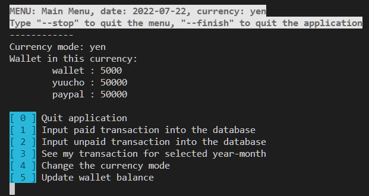
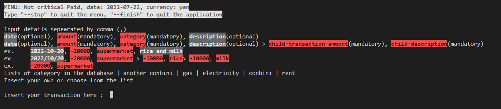
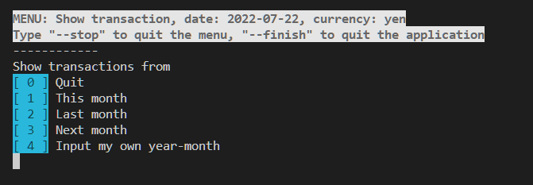
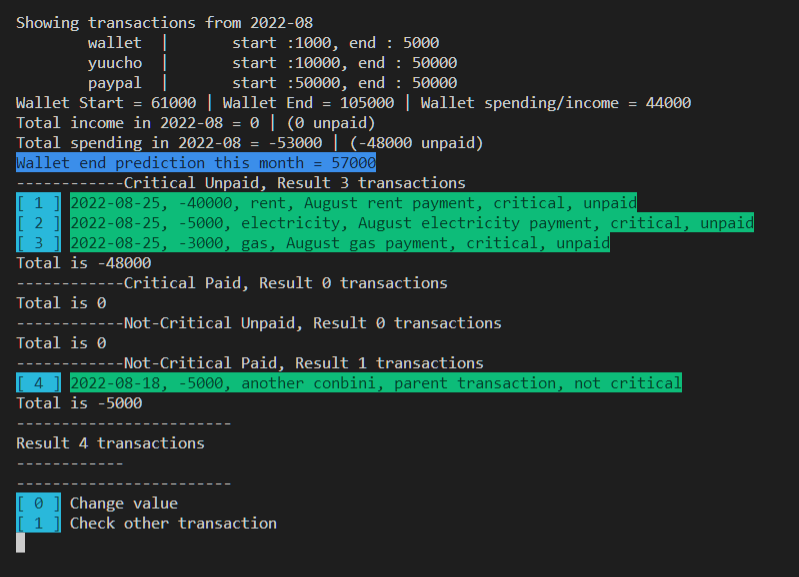
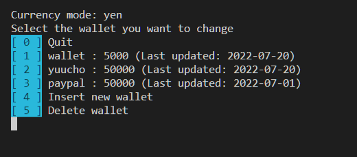

# Personal Finance

    DON'T FORGET TO CHANGE THE PATH IN THE GLOBALENVIRONMENTVARIABLE.JAVA BEFORE RUNNING THE PROGRAM

Personal Finance is a CRUD (Create-Read-Update-Delete) application with Command Line-based Interface to help you keep tracking your spending. The application features

-   <b>Multiple currencies</b> support as many as the user can add, even custom currencies.
-   <b>For the lazy.</b> The user does not have to diligently keep a record of all the transactions or even the details of the transaction. All the user need is to make sure to input the wallet balance at the start and the end of each month.
-   <b>Critical transaction flagging.</b> It keeps track of the important transactions by flagging them as critical (think rent, gas, electricity, etc.) and if the transaction is paid or not.
-   <b>Easy to navigate</b> CLI UI.

## Folder Structure

The workspace contains two folders by default, where:

-   `src`: contains all classes created for this project
-   `lib`: the folder to maintain dependencies
-   `database`: the database and sql commands used in the project

Meanwhile, the compiled output files will be generated in the `bin` folder by default.

## DATABASE USED

SQLite with JDBC

# How It Works

    The user can type --stop to move back up a menu or --finish exiting the application at any time.

### [ 1 ] Input paid transactions into the database

### [ 2 ] Input unpaid transactions into the database

The user will be able to set the transaction inputted into either paid or unpaid according to choices.
Inside they will be presented with choices of:

    [ 1 ] Normal transaction

    [ 2 ] Critical transaction

Then after selecting these, the user will be presented with the menu to input their transaction.

The user can input a single transaction with or without a date and with or without a description, for example:

    2022-10-20, -20000, supermarket, rice and milk
    2022-10-20, -20000, supermarket
    -20000, supermarket
    20000, supermarket, rice and milk

are all valid input. They can also specify the child of that transaction by using the ‘>’ separator. Child transactions are the details of the transaction and do not affect the total transactions. It is there for details.

For example:

    2022/10/20, -20000, supermarket > -10000, rice> -10000, milk

This means that there is a parent transaction of

    Date = 2022/10/20
    Amount =  -20000
    Category = supermarket
    With the childrens as
    -10000, rice
    -10000, milk

Children transactions share the same category as the parent transaction and the field after the amount is a description instead of a category.

### [ 3 ] See my transaction for selected year-month

Will display all the transactions in the specified month from this menu.

For example in the transaction next-month

### [ 4 ] Change the currency mode

Users can also display all the available currency and change the currency mode in the application.

### [ 5 ] Update wallet balance

Users will be able to specify the balance in the wallet currently or at the specified date. They are also able to Insert a new wallet or Delete an existing wallet.

